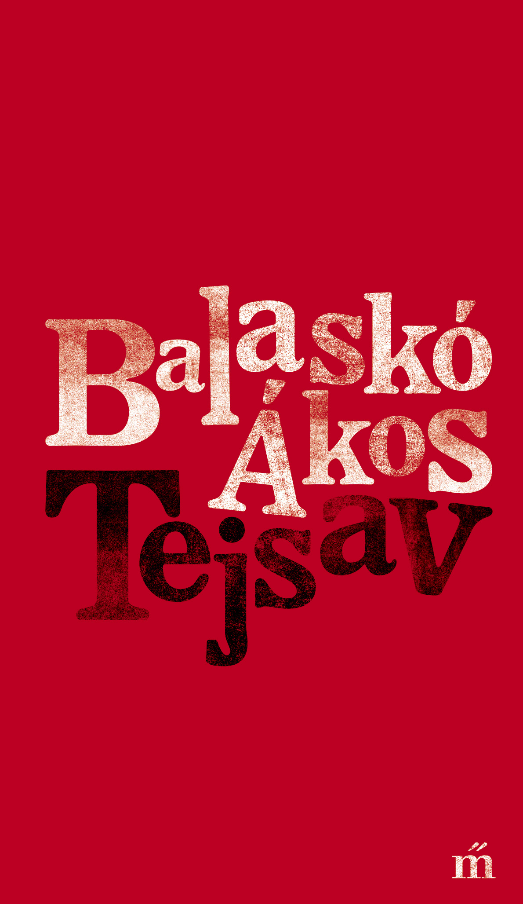
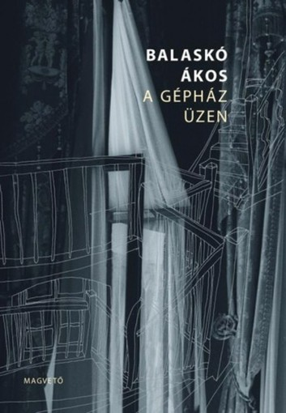

## Tejsav *2018, Magvető Kiadó*
 
A fiatal Petri-díjas költő, Balaskó Ákos második kötete, a Tejsav igazi szerves líra. A könyv verseire jellemző, hogy a kiszolgáltatott emberi léthelyzeteket vegytani pontossággal, de cseppet sem sterilen ábrázolja. Napjaink egyik leggyakoribb lélektani problémája, a kiégés áll a könyv narratív középpontjában. A költő tűéles pontossággal veszi végig egy harminc-egynéhány éves fiatal személyiségének széthullását és lehetséges visszaépülését, illetve ezek stációit. A Tejsav azt a folyamatot dokumentálja és demonstrálja, hogy hová kerül a fókusz, amikor eltávolodunk önmagunktól. A Balaskó-líra másik fontos eleme, forráskódja az irónia alakzata és evidenciája. Kulturális kódok, popzenei utalások, vendégszövegek, transzavantgárd gesztusok szövik át és színezik a kötetet. Balaskó költészete részletekből, apró megfigyelésekből építkezik. Úgy kapcsol össze metaforákat és motívumokat, mintha molekulák lennének, amelyek hatnak egymásra. Így hatnak ránk ezek a versek is a közvetett személyesség szűrőjén keresztül.

## A gépház üzen, *2014, Magvető Kiadó*

A fiatal Petri-díjas költő, Balaskó Ákos második kötete, a Tejsav igazi szerves líra. A könyv verseire jellemző, hogy a kiszolgáltatott emberi léthelyzeteket vegytani pontossággal, de cseppet sem sterilen ábrázolja. Napjaink egyik leggyakoribb lélektani problémája, a kiégés áll a könyv narratív középpontjában. A költő tűéles pontossággal veszi végig egy harminc-egynéhány éves fiatal személyiségének széthullását és lehetséges visszaépülését, illetve ezek stációit. A Tejsav azt a folyamatot dokumentálja és demonstrálja, hogy hová kerül a fókusz, amikor eltávolodunk önmagunktól. A Balaskó-líra másik fontos eleme, forráskódja az irónia alakzata és evidenciája. Kulturális kódok, popzenei utalások, vendégszövegek, transzavantgárd gesztusok szövik át és színezik a kötetet. Balaskó költészete részletekből, apró megfigyelésekből építkezik. Úgy kapcsol össze metaforákat és motívumokat, mintha molekulák lennének, amelyek hatnak egymásra. Így hatnak ránk ezek a versek is a közvetett személyesség szűrőjén keresztül.
                           